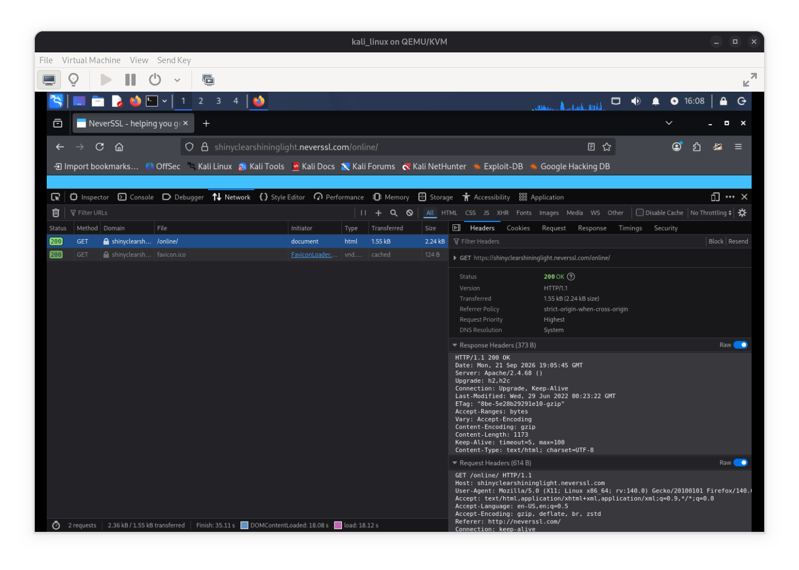

# EJERCICIO ELABORADO POR MARIANO CODUTTI ALARCÓN

ACLARACIÓN IMPORTANTE: El ejercicio fue realizado en Firefox desde un entorno virtualizado con Kali Linux, con el objetivo de analizar el tráfico HTTP en una red no segura y evaluar las medidas de protección necesarias para navegar en conexiones Wi-Fi públicas.

## SITIO ANALIZADO
* **URL:** http://neverssl.com
* **Objetivo:** Analizar las cabeceras HTTP de una conexión sin cifrar a través de las Herramientas de Desarrollador del navegador.

## EVIDENCIA OBSERVADA

Durante la inspección del tráfico de red mediante la pestaña de Network (Red), se registraron los siguientes parámetros:
* **URL solicitada:** http://neverssl.com/
* **Método HTTP:** GET
* **Host:** neverssl.com
* **Protocolo utilizado** HTTP/1.1
* **Headers inspeccionados:** User-Agent, Accept, Host, Accept-Encoding, etc.

## RIESGOS ENCONTRADOS
Al transmitir información mediante HTTP en una red Wi-Fi pública se idintifican los siguientes posibles riesgos:
1. **Sniffing de paquetes:** Un atacante podría capturar la información transmitida en la red local.
2. **Ataques Man-in-the-Middle (MitM):** Posibilidad de interceptación y modificación del contenido de la comunicación.
3. **Exposición de datos sensibles:** Las credenciales, datos personales, cookies de sesión y otros datos se envían en texto plano

## SOLUCIÓN: VPN
El uso de una VPN mitiga estos riesgos mediante:
* **Cifrado punto a punto:** Protege los datos desde el dispositivo hasta el servidor VPN.
* **Túnel seguro:** Oculta el contenido del tráfico de cualquier intermediario en la red Wi-Fi.
* **Privacidad de la IP:** Oculta la dirección IP real del usuario.

## CONSEJOS FINALES: 3 REGLAS DE ORO
1. **Usar siempre una VPN al conectarse a redes públicas.**
2. **Comprobar que los sitios utilicen el protocolo HTTPS para mayor seguridad.**
3. **Desactivar la conexión automática a redes abiertas y el uso compartido de archivos.**

